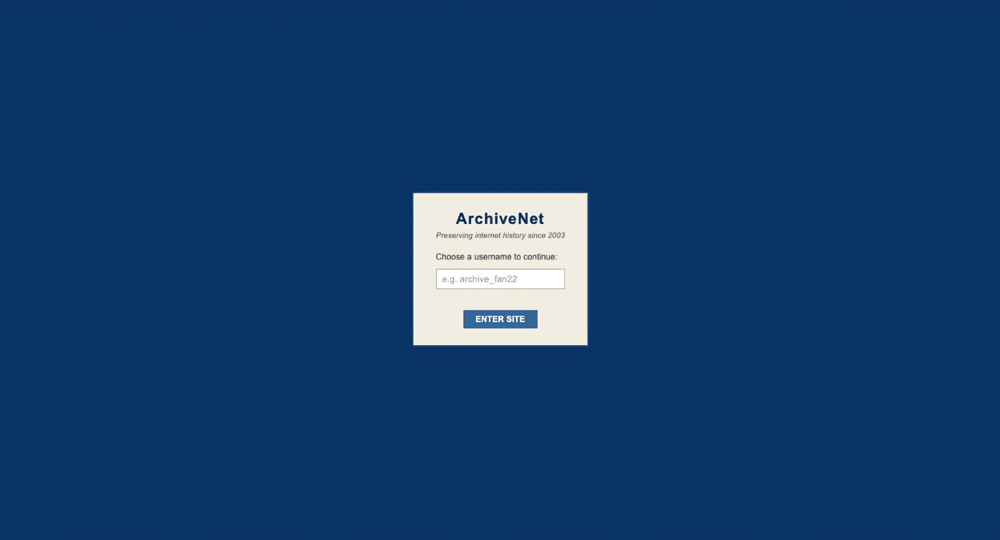
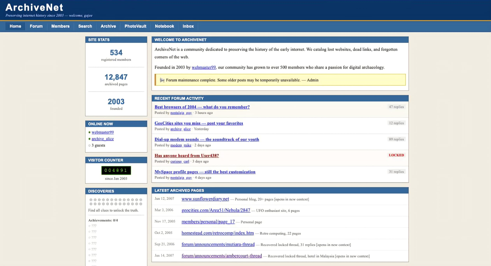

# ArchiveNet

> *"The internet never truly forgets... it just hides things better."*

ArchiveNet is a browser-based **interactive horror ARG (Alternate Reality Game)** built entirely with HTML, CSS, and JavaScript. Inspired by the forgotten internet of the late 1990s and early 2000s, the project recreates abandoned forums, archived web pages, corrupted files, and hidden mysteries that slowly reveal a much darker story.

Unlike traditional horror games, ArchiveNet doesn't rely on jumpscares. Instead, it focuses on psychological horror, internet archaeology, and environmental storytelling, encouraging players to investigate every page, inspect source code, solve puzzles, and question what is real.

As players continue exploring, the archive begins to change. Pages become corrupted, users disappear, advertisements rewrite themselves, hidden files emerge, and the archive itself starts reacting to the player's presence.

---

## Features

* Interactive archived forum threads
* Hidden pages and secret URLs
* ARG-style puzzles and codes
* Dynamic page corruption system
* Timed horror events
* Multiple endings
* Ambient sound design
* Interactive terminals and archived documents
* Hidden source-code clues
* Slowly unfolding mystery spanning multiple webpages

---

## Story

ArchiveNet presents itself as an online archive dedicated to preserving forgotten websites.

While browsing recovered forum posts and archived pages, players uncover references to missing users, abandoned locations, deleted investigations, and events that official records no longer acknowledge.

One mystery leads to another.

Recovered files begin contradicting one another.

Users vanish from old discussions.

Posts rewrite themselves.

Eventually, the archive no longer behaves like a website.

It behaves like something that knows you're reading it.

---

## Gallery

### Main Archive

### Recovered Forum Thread

---

## Built With

* HTML5
* CSS3
* Vanilla JavaScript

No frameworks.

No backend.

Everything runs entirely inside your browser.

---

## Current Content

* Archive homepage
* Recovery announcements
* Interactive forum system
* Corrupted archive pages
* Hidden documents
* Fake advertisements
* Timed archive corruption
* Secret files
* Multiple discoverable endings
* ARG puzzles and hidden clues

More archive records and investigations are continuously being added.

---

## Recommended Experience

For the best experience:

* Explore slowly.
* Read every post.
* Click everything.
* Listen carefully.
* Revisit pages later.
* Inspect the source code.
* Some pages only change after spending time inside the archive.

---

## Warning

This project contains themes of:

* Psychological horror
* Fictional disappearances
* Internet mystery
* Disturbing imagery
* Audio effects
* Flashing corruption effects
* Fictional documents and investigations

Everything within ArchiveNet is a work of fiction.

---

> **"Some archives preserve history. Others preserve things that should have stayed forgotten."**
